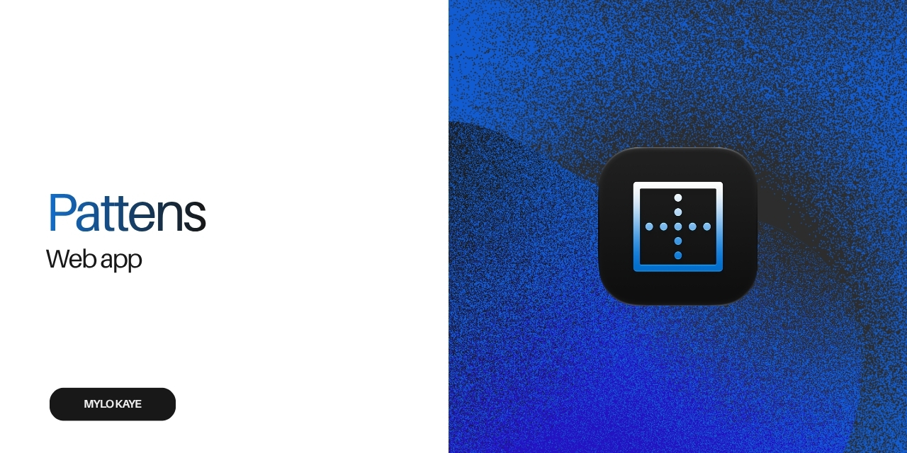
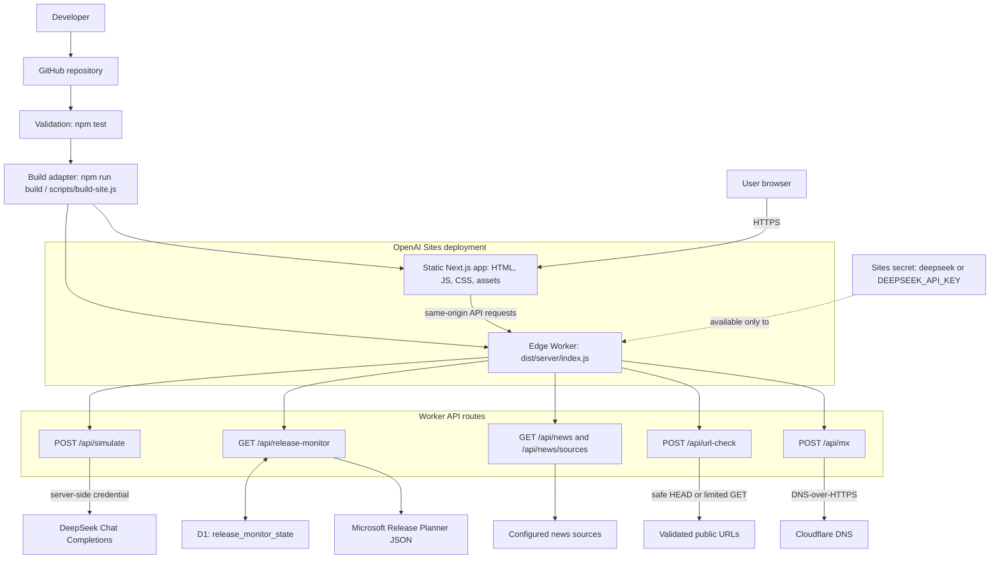

# Pattens

Pattens is a privacy-focused campaign-operations toolkit built with Next.js, TypeScript, Tailwind CSS, and shadcn/ui. It is prepared for static hosting with a small Sites worker for MX lookups and proposal simulations.

# Pattens infrastructure

**Updated on:** 2026-07-30

This diagram describes the current build and runtime infrastructure. Update both the diagram and the date above whenever a change affects deployment, runtime services, API routes, data stores, secrets, or external integrations.



## Tools

- **Generate** — Create campaign URLs, campaign names, and survey URLs.
- **Validate** — Check email syntax, duplicates, and domain MX availability; export results as CSV.
- **Logic** — Generate Dynamics FetchXML from validated country or state lists. Ambiguous state names are flagged and cannot be generated.
- **Simulation** — Test a proposal with a defined audience panel and review a simulated round-by-round debate, key concerns, and a recommended next step.
- **Studio** — Turn screenshots into polished 3D browser mockups with a local WebGL canvas, camera controls, colour gradients, and PNG export.
- **Convert** — Reserved for the Dynamics email converter migration.

## Run locally

```bash
npm run dev
```

Then open [http://localhost:3000](http://localhost:3000). During local development, the Home page server-renders the current public stories and roadmap updates; it reads the Microsoft 365 roadmap RSS and [Meghan Walker RSS](https://meganvwalker.com/feed) feeds directly. Owner-only news-source management remains available only on the deployed worker.

## Verify and build

```bash
npm test
npm run build
```

`npm run build` exports the static application and emits the Sites worker at `dist/server/index.js`.

The current deployment and service topology is documented in [Infrastructure](docs/infrastructure.md).

## Project structure

- `app/` — Next.js routes and layout.
- `features/` — Tool-specific UI and browser logic.
- `components/` — Shared shell, UI components, and visual primitives.
- `assets/` — Country and state data masters used by Logic.
- `scripts/build-site.js` — Static export and hosted worker build.
- `Archive/` — Retained legacy static implementation, converter reference material, archived tests, and unused UI components.

## Interface standards

- Tool workspaces use a responsive two-column grid that collapses to one column on narrower screens.
- Feature-card headers are 40px horizontal rows, with the title on the left and any metadata, tabs, or compact controls aligned on the right.
- Form fields and normal action buttons are 50px high. Compact controls in card headers are 32px high.
- Text inputs use the floating-label field pattern. Selects retain a fixed label above the control.
- Card bodies use 16px padding, related controls use 16px gaps, and major panels use 24px gaps.
- Reuse `MetricTile` for compact status and summary values rather than creating feature-specific metric cards.
- Empty output areas are quiet, bordered states. The Generate output stays text-free until an asset has been created.
- `public/crm-logo.png` is the shared Pattens brand asset for the header, favicon, and social metadata.

## Privacy

Most processing stays in the browser. For hosted MX validation, only a domain is sent to the worker resolver; email addresses are not sent. MX records indicate whether a domain accepts mail, not whether an individual mailbox exists.

Simulation sends the supplied proposal, selected audience, duration, and fixed persona panel to DeepSeek through the protected Sites worker. The API key remains in Sites as the `deepseek` secret and is never exposed to the browser. Simulations are scenario exercises, not observed audience evidence or forecasts; the generator is instructed to treat the proposal as its only factual source.

## Hosted site

[pattens.mylokaye.me](https://pattens.mylokaye.me)
